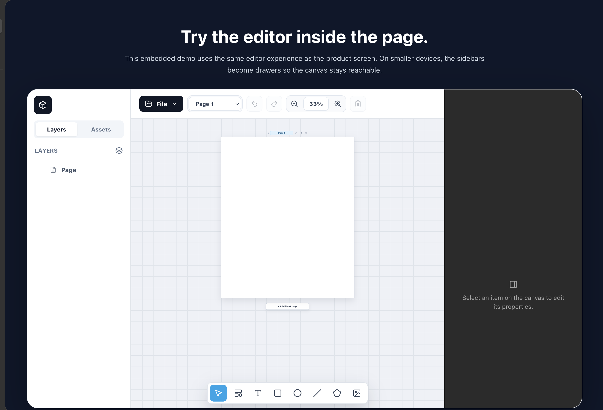

# Builder Thinking

Builder Thinking is a Canva-like page builder built with React, Craft.js, and Lexical. It focuses on visual document creation: resumes, portfolios, posters, multi-page documents, and AI-generated design layouts.

> Status: alpha. Builder Thinking is usable as a prototype and portfolio-grade editor, but APIs, schemas, and project file formats may still change.



## What It Does

Builder Thinking gives users a browser-based design workspace with a real editable canvas, page management, layers, assets, inspectors, rich text, export tools, and responsive drawer sidebars.

The project currently has two main surfaces:

- Landing website: introduces the product, includes a live embedded editor demo, and routes users into the full editor.
- Full editor: the main builder experience for creating and exporting visual pages.

## Core Features

### Landing Page

- Product-focused landing page with hero content, CTA buttons, feature sections, workflow section, and responsive messaging.
- Placeholder areas for future product images and videos.
- Embedded live editor demo inside the landing page.
- Start buttons route users into the full editor through `#editor`.

### Canvas Editor

- Built on `@craftjs/core`.
- Editable page root with selectable nodes.
- Drag, create, move, resize, and delete canvas elements.
- Multi-page document workflow with page add, duplicate, rename, reorder, and delete.
- Desktop-first workspace with mobile/tablet drawer sidebars.

### Layout And Elements

- Page root and section nodes support visual layout configuration.
- Free layout behavior for absolute positioning.
- Auto layout modes for horizontal, vertical, and grid-like arrangements.
- Nested sections: sections can contain other sections and nodes.
- Shape support for rectangle, ellipse, line, polygon, star, image-like nodes, and SVG asset icons.
- Image/background fill support with local file import.

### Rich Text

- Text editing uses Lexical.
- Text can be edited directly on the canvas.
- Inspector controls support typography-related settings.
- Multiple local font families are available through `@fontsource`.

### Inspector Panels

- Root page inspector for page size, layout, appearance, fill, stroke, and export-related configuration.
- Section inspector separated from other component inspectors.
- Text inspector for typography and text appearance.
- Shape inspector for shape fills, strokes, image modes, and related visual settings.

### Layers And Assets

- Left sidebar includes Layers and Assets tabs.
- Layers show node structure and icons for easier scanning.
- Assets include predefined SVG/icon-like items that can be added to the canvas.
- Mobile/tablet left sidebar collapses into a centered drawer toggle.

### Toolbar And Controls

- Top toolbar includes page controls, undo/redo, zoom, delete, and File menu.
- File menu groups Import, Export, and AI Guide actions into a multi-level dropdown.
- Bottom component toolbar provides creation tools for pointer, section, text, shapes, line, polygon, and image.
- In landing demo mode, the bottom toolbar is scoped inside the demo frame instead of fixed to the page viewport.

### Import And Export

- Export to PNG.
- Export to PDF with multi-page output.
- Export project file.
- Export JSON token for AI/tooling workflows.
- Import project file.
- Import raw JSON token through a large text input.
- AI design guide can be copied or downloaded.

### Responsive Behavior

- Full desktop workspace is the preferred editing mode.
- Tablet/mobile show a dismissible desktop-recommendation popup.
- Left and right sidebars become drawers below `900px`.
- Closed drawers show a single centered expand icon on each side of the viewport.
- Landing page is responsive and avoids horizontal document overflow.

## Tech Stack

- React
- Vite
- Craft.js
- Lexical
- Lucide React
- html2canvas
- jsPDF
- JSZip
- Fontsource packages
- Playwright for visual/smoke checks

## Open Source

Builder Thinking is released under the MIT License.

Before using it in production, review the current alpha status and test the editor workflows that matter to your use case.

Useful files:

- `LICENSE`: license terms.
- `CONTRIBUTING.md`: contribution guidelines.
- `.github/ISSUE_TEMPLATE/`: bug report and feature request templates.

## Project Structure

```text
src/
  app/
    providers.jsx
    queryClient.js
    store.js

  features/
    editor/
      ai/
      assets/
      components/
        assets/
        canvas/
        controls/
        layers/
        panels/
        toolbars/
      export/
      hooks/
      text/
      utils/

    landing/
      components/

  shared/
    api/
    config/

  App.jsx
  main.jsx
  styles.css

docs/
  assets/
    editor-overview.png
```

## Environment

Vite environment variables are read through `src/shared/config/env.js`.

Create a local `.env` file from `.env.example`:

```bash
cp .env.example .env
```

Current supported variables:

```text
VITE_APP_NAME=Builder Thinking
VITE_API_BASE_URL=
```

## Run Locally

Install dependencies:

```bash
npm install
```

Start the dev server:

```bash
npm run dev
```

Build for production:

```bash
npm run build
```

## Contributing

Contributions are welcome while the project is in alpha. Please keep changes focused and verify the editor route before opening a pull request.

Read the full guide:

```text
CONTRIBUTING.md
```

## Routes

- `/` or `#home`: landing page
- `#editor`: full editor

## Screenshot

The editor screenshot used in this documentation is stored at:

```text
docs/assets/editor-overview.png
```

It was captured from the full editor route:

```text
http://127.0.0.1:5174/#editor
```

## Current Direction

The project is moving toward a full user-facing web product:

- Landing page for acquisition and product explanation.
- Full editor for design work.
- AI-oriented JSON token import/export for generated designs.
- More production-ready document export and asset workflows.

## License

MIT. See `LICENSE` for details.
